# AI Data in Application Development / Data in the AI Revolution

## Introduction

This repository aims to be a guide on all types of data usually found in the realm of Data Science and Artificial Intelligence.

We are living in the Big Data era, where the volume, velocity, and variety of data generated every day are unprecedented.

From social media interactions, sensor data from IoT devices, transaction records, to large-scale scientific experiments, the amount of data we encounter is enormous. This explosion of data in the last decade presents both challenges and opportunities (how do we process all this data efficiently?).

On one hand, managing and processing such vast amounts of data require advanced tools and technologies. On the other hand, this data holds the key to solve many complex problems with the help of computers.

## 0. Prerequisites & Docs

### Prerequisites

In order to follow the contents of this workshop, you will need the following:

An Oracle Cloud Infrastructure (OCI) Account. Although it's not explicitly required as you don't have to follow any of the steps by yourself, it's still recommended as you will be able to explore the services and use cases we mention in the workshop on OCI, while scanning through the content.

### Docs

- [Computer Vision: COVID-19 Mask Detection - Data Labeling](https://oracle-devrel.github.io/devrel-labs/workshops/mask_detection_labeling/index.html)
- [Computer Vision: COVID-19 Mask Detection - Model Training](https://oracle-devrel.github.io/devrel-labs/workshops/mask_detection_training/index.html?lab=intro)
- [Open-source TensorFlow playground](https://playground.tensorflow.org/)
- [CNN Explainer](https://poloclub.github.io/cnn-explainer/)

## 1. Data for each type of problem

There are lots of problems that fall into the realm of Artificial Intelligence. However, not all data fits the desired format to solve a specific type of problem. Depending on what type of data we have available, we'll be able to use it in one way or the other.

For example, all AI models that are used to generate text require **text data**. On the other hand, models that are used to process **images or video**, to detect objects on these images, or segment them, require 2-dimensional data. We'll talk about more of each type of data in the next sections.

### Text data

This is the most common type of data we have available. It's usually found in the form of text, and can be used to train a model to perform various tasks:

- Generate new text, or paraphrase already-written text
- Summarize the contents of big text chunks
- Translate text from one language to another
- Fill in missing words in a text

Large Language Models (LLMs) and text-generation Generative AI (GenAI) fall into this category. Nowadays, we have some models, like GPT-4 or Cohere Command R, that have been trained on terabytes of data (usually unfiltered, compressed text).

Here's a quote from an excerpt on the GPT-3 paper:

> "The raw (before filtering) training set was `45TB` of compressed plaintext. After filtering, it was `~570GB`. It used text scraped from the internet, wikipedia and books. The final model is `~175B` parameters."

The prominent architecture for the Neural Networks in this type of data is called **Transformer** Architecture. We will learn more about how the transformer architecture "mimics" human language, and how it helps computers understand our human way of thinking. Here's a figure representing the transformer architecture:

### Predictive Machine Learning

This is the type of use case where we have:

- Loads of data about one specific domain
- The need to transform this data into a manageable (in size), deterministic **predictor** of one or multiple features of the data.
- We want the ML model to make a predictions using as many *important* variables as possible, to achieve maximum precision on predictions
- The problem we're solving typically needs to be so big/untimely that you'll be saving time by creating a ML model to make your life easier now, or in the future.

For example, here we have a project we developed, called [League of Legends optimizer](https://github.com/oracle-devrel/leagueoflegends-optimizer), a framework to create your own Machine Learning models for League of Legends, an extremely popular videogame.


Without going into gaming jargon too much, in this image, we have two teams fighting in the bottom part of the map for gold and kills. League of Legends is such a complex game, that we can't just use the raw data (video) to create a Machine Learning model -in theory, we could, but detecting the objects that appear on the screen would offer no value other than the mere excitement from creating such a model-.

Remember that ML models are typically hyper-specialized in predicting something. Therefore, we need to **encode** the data we have (images / video, what we see on our screens) in a way that a ML model understands (numbers).

So, from the hundreds of variables we have, we need to do some kind of processing of this data, to turn it into a Machine Learning-friendly format. Using their official API, what you see on the screen gets translated to something like this:

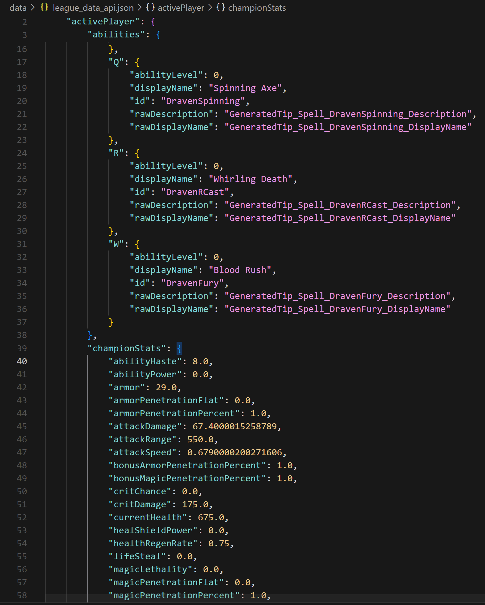

As you can see, one simple image gets translated into a 300-line JSON object (see [the complete JSON struct here](./data/league_data_api.json)), including all things, like items purchased and their order, the current active abilities for each champion, each event that has happened since the beginning of the game... This can translate to hundreds of megabytes of data every match.

With some Exploratory Data Analysis (EDA) we're able to select which variables are useful, and start creating a ML model with this "encoding" we mention.

This is what Predictive ML focuses on: **analyzing, modifying and transforming** the data received, to extract meaningful predictions and conclusions from this data.

### Computer Vision: Images & Video

Here, we can find all problems related with the following use cases:

- Object detection
- Image segmentation
- Video processing

Sometimes, detecting an object can be quite easy, as many objects we encounter in real life are very repetitive and can be found anywhere. For this purpose, there are lots of pre-trained models available, which can be used to detect objects in an image.

The issue arises when we're trying to detect something **new**, or something noone had trained a model in the past. For this, we need to train our custom models.

For example: during the COVID-19 pandemic, and since masks weren't broadly used prior to that - except for some countries like China - we needed to create our custom detection system to detect 3 mask states:

- Properly-worn masks (with the nose and both ears covered)
- People with no mask on whatsoever (there are lots of examples on the Internet for this, as 99% of people on the Internet don't have masks on their pictures)
- Incorrectly-worn masks (either the nose not covered, people with the mask hanging from one ear...): this is what we specifically wanted to detect with our model: warn of those users wearing their mask incorrectly and ask them to place the mask correctly.

[](https://www.youtube.com/watch?v=LPRrbPiZ2X8)

As an example of what we can usually obtain from an image, take a look at this picture:


Typically, companies and products offer this processing through APIs and Data Engineering tools, to help extract data from the sources.

A perfect model would, in theory, return **all** the information from an image. We can never have all of the information: since we can't know what the data will be used for, the ideal model would extract as much data as possible, to accomodate to every kind of problem.

Here's a rough approximation of what we can obtain with OCI Vision using the dog image above:

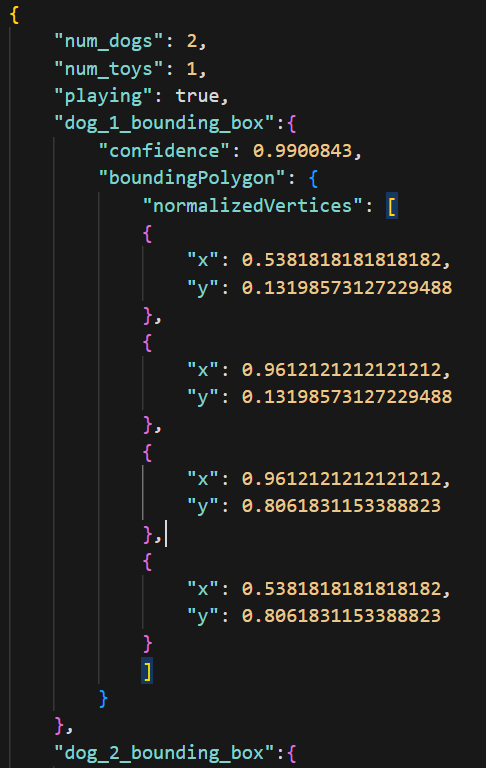

> You can't directly extract the number of dogs or toys, but you can indirectly count the number of appearances of one type of object and add this information to the JSON object.

In the guide, we'll dive deeper into how these results can be interpreted and integrated as a developer into your workstream.

## 2. Predictive ML: In Depth

This domain of Machine Learning focuses on using historical data (or previously collected data) to forecast what happens in the future.

It has the following characteristics:

- Requires loads of data (typically), unless working with decision trees. It's not only about the amount of data but the *quality* of it - the variables included in this data need to be relevant to the problem we're trying to solve
- The main goal is to create a predictor, from extensive data, of one or multiple variables within the data
- The model aims to maximize accuracy and precision by including as many important variables as possible in the prediction domain.
- Development of a ML model would save significant time and resources as opposed to doing these predictions manually 

For this example, we consider a Machine Learning model from a car dealership company, that wants to predict the buying probability of a new model car they just introduced to the market, based on some basic data from their customers.

I have created some Manim visualizations, so that the basic concepts of Predictive ML can be understood better:


Having this data:

```bash
[Name: John, Age: 30, Income: $50k, PreviousCars: 2]
```

We want to predict their **purchasing probability**. We need to perform some steps, like exploring the data that's available to us, seeing which variables may be of interest, and encoding these variables (especially those that represent words) into numbers, which will be digestible by the ML model. The process of exploring and choosing important variables is called **feature selection and engineering**. 

After doing these steps, and having a big and rich enough dataset, we can train the model on these examples, based on previous occurrences.

```text
I had 300 customers in the past, their income, name, age and number of cars, were X, Y, Z, and W, and 113 of them bought a car within the next 7 days after coming to the dealership. 
```


We have done several projects in the past talking about Predictive ML, feel free to check out these projects and see how I solved each step with great detail:

- [Oracle RedBull Racing x Oracle: Creating a Data Science Pit Strategy for the team](https://github.com/oracle-devrel/redbull-pit-strategy)
- [League of Legends Optimizer - Learn Artificial Intelligence with Gaming](https://github.com/oracle-devrel/leagueoflegends-optimizer)

As you can see, data needs to be in numerical format - at least at the end of the process - so that the model (a natural extension of the computer) can understand the data we provide it. If we have any non-textual data, we need to make some additional processing to turn this data into numbers (through APIs, processing of our own...).

Since Predictive ML works with textual data, I consider this to be the simplest sub-field of Artificial Intelligence, at least at the moment.

> As a general note, Predictive ML *usually* focuses on finding linear relationships between variables. Non-linearity can be achieved by training NN-based predictive models, which excel at finding non-linear properties and correlations between variables. Most of Predictive ML does **not** consider NNs, and focuses on other types of models (gradient boosting models, decision trees, linear regression, logistic regression...)

## 3. Large Language Models: In Depth

LLMs use the Transformer Architecture to learn and make predictions using Neural Networks.

There are three types of LLM architectures within the transformer architecture, and each type specializes on solving a type of problem:

- Encoder-only: it's good at understanding input text. It's widely used for tasks like **text completion** (completing missing words in a sentence) and **text classification**. An example is BERT (Bidirectional Encoder Representations from Transformers), a quite popular encoder-only model used for sentiment analysis and many other language related tasks that require a deep understanding of the context of words.
- Decoder-only: it's good at generating text. It's used for **text generation / completion**, what you typically have nowadays with OpenAI, OCI GenAI, etc. Their GPT models are decoder-only.
- Encoder-decoder: it's good at understanding both the input and generating the output. It's used in tasks like **text translation** and **summarization**. An example model is T5, used for text translation.

As you can see on the following figure, the typical architecture of transformers is the following:


> We will refer back to this figure during this session as it contains the most mentioned components of LLMs

There are two things being highlighted: **self-attention** and **feed-forward**. But, what does this mean, and how are these concepts applied in Neural Networks?

When using these models, we need to remember that a Neural Network only understands numbers, not our alphabets and languages. Therefore, there's a special part on these systems, which takes charge in doing the required human-to-machine translation: from characters or groups of characters (we call them **tokens**) to their numerical equivalent representations. This functionality is provided by the **tokenizer** and the **embeddings model**.

We will check out all these concepts in the following subsections.

### Tokenizer & Embeddings Model

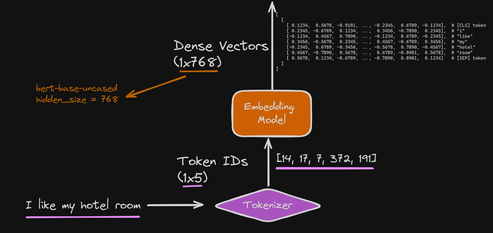

A tokenizer is the part of the system that breaks down the original, human-readable text into smaller units, called tokens. Tokens represent words, characters or groups of characters; this is determined by the tokenization strategy used by the creator of the tokenizer.

The tokenizer converts the text into a sequence of token IDs, and these IDs are then stored in a reference table so that this process can then be reverted back into human-readable language at the last step of the transformer architecture, so we can read the text back.

In a simplified example, from the sentence "I am happy", we would get:

```bash
[13, 93, 732]
```

Then, these token IDs are used by the **embedding model**, which converts this sequence of IDs into *dense vector* representations. These dense vector representations try to encapsulate the meaning, syntax and context of tokens.

These dense vectors have hundreds of dimensions, many more than the sequence of token IDs. For example, in the case of BERT, each token is represented by a 768-dimension dense vector.

On a final note, since the tokenizer and the embedding model work together, they need to be perfectly **in sync**, as the tokenizer needs to produce token IDs that will be identified and recognized by the embedding model; otherwise, the hidden meaning in words we use as humans wuold be lost or misinterpreted.

Tokenizer and embedding model are sometimes used interchangeably as they are often packaged together, but they are different components that work in unison.

Here's [a Python script](./scripts/check_embeddings_matrix.py) you can run to see how embeddings are represented in tensors based on your own input. To run it:

```bash
pip install -r scripts/requirements.txt
python scripts/check_embeddings_matrix.py
```

### Self-Attention or Multi-Head Attention

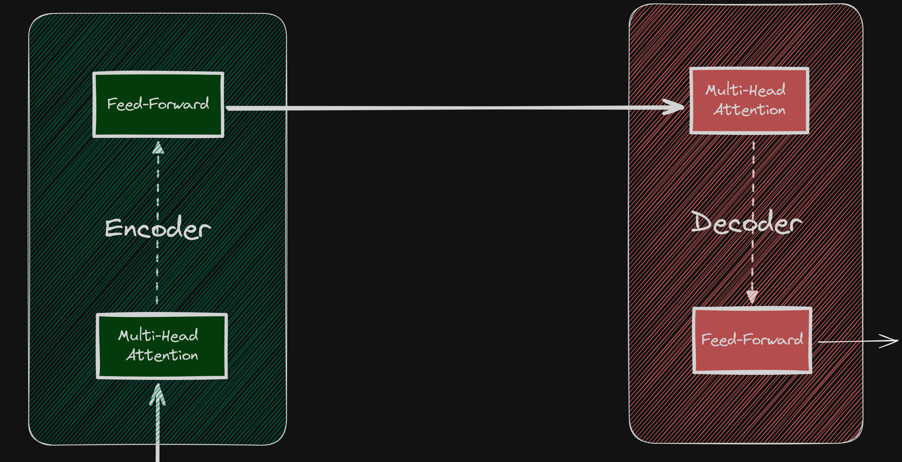

Self-attention is the mechanism used to determine the importance of different parts of an input text when processing this text. This is the foundation of LLMs in the sense that it captures what we call as the **context** of a large input text.

For each token in the input text, self-attention considers and keeps 3 variables:

- Query: what the token is looking for, Q: it holds the current word or token for which we want to compute the attention weights
- Key: what the token can offer, K: it's a vector that represents each word or token in a text sequence. It's useful to match against Q (dot product), and determine how much attention the query should pay to each word in the sentence.
- Value: the value of the token, V

Then, for each token, the attention score of this token with every other token is calculated. In an over-simplified manner, for a token `x`, this calculation is the dot product of `Q(x)·K(y)`, where `y` is another token in the input sequence (and then some transformations to those results).

On the other hand, multi head attention is the **improved** version of self-attention, where we have multiple sets of (Q,K,V) matrices (typically 8 or 16 on current state of the art models). These sets of matrices are what's called the **attention heads**, and each head can focus on different concepts:

- One head can focus on syntactic relationships between words
- Another can focus on the semantics
- Two other can focus on the short and long-range relationships between words...

The number of these attention heads and their behavior is configured by the creators of the models, and directly affects the output of a model, as it determines what this model focuses on when reading the input text.

Let's say we have the following sentence:

```bash
"Nacho slept on the couch last night, which was a bit too hard for his back."
```


Each head would look at different parts of the text, and create their respective (Q,K,V) matrices. For example:

Head #1 focusing on **syntactic** relationships:

- subject-verb relationships: studies the relationship between `Nacho` and `slept`
- verb-object relationships: `slept` and `couch`
- preposition-object relations: `on` and `couch`

Then, another head to study **temporality** (when the action occurred):

- `slept` and `last night` describe when the action of sleeping occurred.
- `was` and `last night` describe the temporal context for the roughness of the couch, last night.

Another one for **causal relationships**:

- `hard` and `back` describe the impact the couch had on my back
- `slept` and `couch` and `hard` and `back` describe a chain of events, called chain of causation

And this can go on and on until 8 or 16 attention heads (typically). This allows the context of what we are reading to *assimilate* what the human brain does with neurons in the background, and truly gives us a glimpse of how incredibly intelligent we are, as humans that use language, without even noticing it.

These subtleties in language are what is in the end calculated by the heads, and they are then *concatenated* and *linearly transformed* to produce a numerical, LLM-friendly representation for **each token** in the input text.

Thanks to this, and going back to our previous example, the model was able to consider the following aspects (and more) from the text:

- The syntactic role of "hard" as an adjective describing the couch
- The temporal context of when the couch was hard
- The object (couch) that "hard" is describing
- The consequence of the hardness (effect on the back)
- ...and many more.

Here's a visualization of each head's attention weights:


This gives you an idea of how each head looks at the text in a different manner and extracts different weights, depending on how they've been programmed and what the property of language they focus on.

I've created [a Python script](./scripts/check_attention_heads.py) so you can visually see the differences in attention weights from each head based on your own input. To run it:

```bash
pip install -r scripts/requirements.txt
python scripts/check_attention_heads.py
```

### Feed-Forward NNs

Without going much into detail (yet) into Neural Networks, there are two types of Neural Networks: Feed-Forward NNs and Recurrent NNs (RNNs).

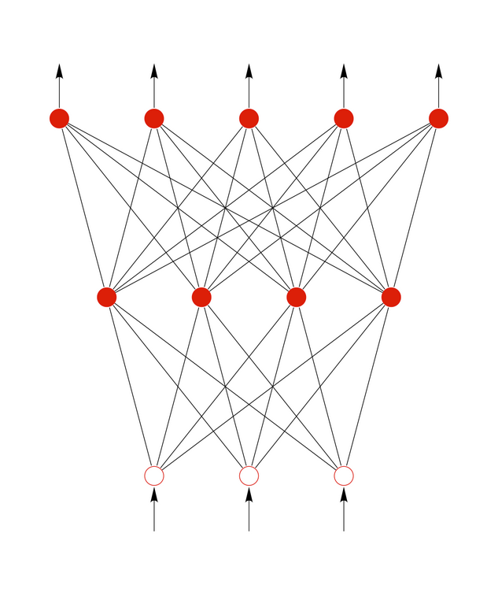

> This is an image of a FFN, where all neurons from layer M transmit information to all other neurons in layer M+1, only in that direction (no backward data transmission of any kind)

For now, just know that a FFN (Feed-Forward Neural Network) is a type of NN where we see only forward steps from the inputs towards the outputs.

Since data is transmitted always in the same direction, a FFN doesn't learn from iterations the same way a RNN does. However, it the transformer architecture, doesn't need to: self-attention does the learning part, and the FFN is used for two reasons:

- With FFNs, you can process all operations in parallel, which results in less training and inference times compared to RNNs
- You don't run into some common issues that happen in RNNs, like the **vanishing/exploding gradient problems**, which happens when propagating data backwards (backpropagating) through the RNN during the training phase (either gradients become extremely small or huge, which leads to having minimal weight updates, slowing or preventing the learning mechanism from working).

Let's imagine a text with 100 words.

```bash
"I am a scientist. I began my experiment by creating my dataset and then kept going... <some words in the middle> ... And in the end, it worked, and I was subsequently hit in the face with a splash of joy and enthusiasm."
```

Let's have a look at what the Neural Network would do with our text:

- The NN processes this text token by token
- At each step, it tries to predict the next word based on all previous words (remember, generations are created token by token)
- When training, if we focus on predicting the last word, "enthusiasm", the error gradient needs to be backpropagated all the way back to the beginning of the sentence (100 times). This means that, the longer an input sequence is, the more calculations it will need to do before being able to predict the next token.

Consider a RNN processing the following sequence. Since RNNs transmit information backwards after every iteration (to update the weights and biases of the previous layer's neurons), the gradient at the last step (step 100) would need to be propagated back through all 100 steps. If at each step, the gradient is multiplied by the value 0.9:

```bash
0.9^100 ≈ 2.66 × 10^-5 (an extremely small number) = 0.0000266
```

This means that the contribution percentage of the first word `I` to predicting `enthusiasm` would be scaled down by a factor of about `0.0000266`, meaning, by a factor of `~x37.500`. This tiny gradient makes it very difficult for the network to learn long-term dependencies, such as understanding that the entire paragraph is about a scientific experiment, which might be relevant for predicting words near the end.

This problem gets worse the longer our paragraph gets, which isn't great. That's why the vanishing gradients problem is something to avoid when working with Neural Networks.

In the case of the transformer architecture, the **self-attention** mechanism allows direct connections between any two positions in the sequence, regardless of their distance. This easily avoids the vanishing gradients problem in most cases -except for some very isolated issues in very deep networks, with lots of hidden layers-.

### Use Cases

- [Create an AI-Powered Recipe Generator with ChefGPT](https://www.oracle.com/artificial-intelligence/create-an-ai-powered-recipe-generator/)
- [Creating Job Descriptions Using Generative AI](https://www.oracle.com/artificial-intelligence/using-generative-ai-to-create-job/)
- [Extract and Summarize Web Content with OCI Generative AI](https://www.oracle.com/artificial-intelligence/web-summarization-with-gen-ai/)

## 4. Computer Vision: In Depth

### Introduction to Computer Vision

On the field of computer vision, three of the most common tasks or use cases that this field tries to solve are:

- Object detection: detecting a specific object in an image, or classifying the image itself into a category.
- Image segmentation: splitting different parts of an image, depending on colors or shapes, to augment the information in the image for other computer vision related tasks.
- Video processing, which is just an extension of object detection and image segmentation, but in a sequence of frames, rather than looking at just one image.

In this field, we're always using Neural Networks. the most widely used architecture is a different type from what we've seen so far in the workshop: these are called Convolutional Neural Networks or CNNs.

There are other types of NNs used in Computer Vision, like **GNNs** (Graph Neural Networks) that are used when we want to represent image data as graphs, like pose estimation or detecting 3D shapes.

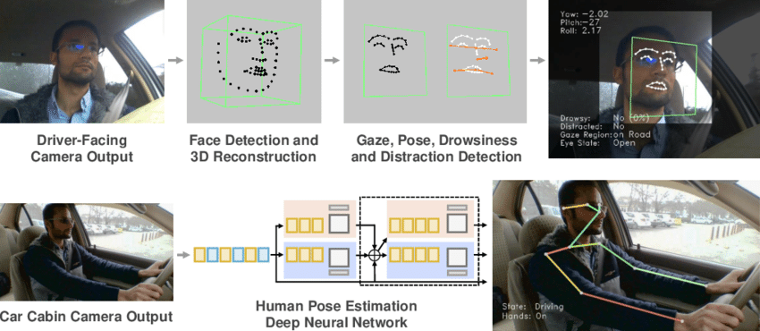

There's also a newer type of architecture called **Vision Transformers (ViTs**) that use the transformer architecture to perform specific tasks on images, like image segmentation and image classification. They are gaining popularity over time as some of them outperform CNNs in some regards, but they have some drawbacks: they are less scalable (they typically require much more training data to get good performance) and they are much more computationally intensive (especially with RAM and GPU/CPU loads) due to the design and the huge amount of vectors that hold data in the transformer architecture compared to CNNs. For this reason, they are a less popular option than CNNs, and we shall focus on the latter.

### Introduction to neurons and the human brain

Today, we're going to talk about Neural Networks in their simplest form, as understanding it this way will help you later understand more modern variants of Neural Networks that hyper-specialize to solve a specific type of problem.

Neurons attempt to replicate the behavior in the our brains. In short, our brain is composed of two types of matter: grey matter and white matter.


Our brains are made up of neurons. They look grey. And as we grow up, more of those neurons get wrapped in this white stuff, called **myelin**. Neurons transmit information between each other.

With myelin, neurons can talk to each other about 3000 times faster! (like upgrading to fiber optic internet).


This is a huge renovation that happens in your brain, from birth until we are around in our early 20s.

A NN is a system in Machine Learning that attempts to simulate the human brain's way of thinking, and teaches computers how to process data. A (NN) implementation works just like a neuron in the human brain:

- We have artificial neurons called perceptrons, and these hold a number and perform basic operations. (We'll talk more about this)
- A perceptron, just like a neuron would, connects with other neurons through axons or synapses (which in NNs are called **configurations**), to transmit data bilaterally
- Each neuron will transmit information and, as we grow older, neurons will form stronger bonds / paths with other neurons, based on personal experiences, memory, what we feel... This strengthening between some neurons is, more or less, similar to a NN learning the correct path to traverse in the network when being presented with some data. The network learns this with a concept called backpropagation.

### Visual Aids for Neural Networks

TensorFlow has created an [open-source playground](https://playground.tensorflow.org/) to allow anybody to try NNs visually.

You can also take a look at [another open-source tool](https://poloclub.github.io/cnn-explainer/) for visualizing one type of Neural Networks called CNNs or Convolutional Neural Networks.


> The example that we can see in this Neural Network is very simple and only has one input layer, one hidden layer, and one output layer.

Here's what a Neural Networks looks like, even if it's not pretty. Note that every neuron is connected to **all other neurons** in the previous layer, so they all the ability to transmit information bilaterally:

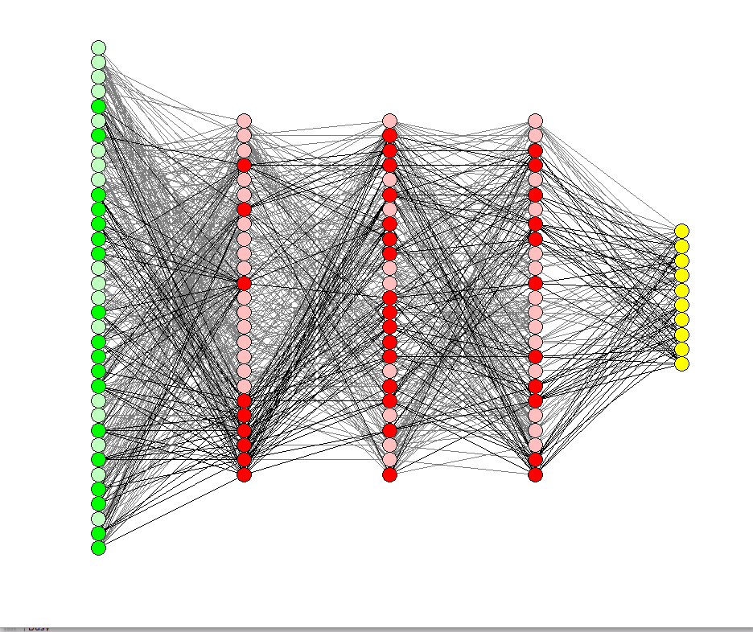

### How does learning work

Let's go over one of the most popular image classification datasets out there, and also one of the most basic ones: the MNIST dataset. It's a large database of handwritten digits, with about 60.000 examples, and a test dataset of 10.000 examples (to later check against the training that we did, and ascertain if we did good or not).


> Each image is exactly 28 pixels x 28 pixels (784 pixels in total). Also, all images are represented in greyscale, meaning they don't have RGB components, they just have one dimension, representing the greyscale value of the corresponding pixel, ranging from 0 (black) to 1 (white).

Now, let's consider one of the digits: 3.


This number, if represented by a computer, and according to the properties mentioned before (28x28 pixels in grayscale) looks like this:

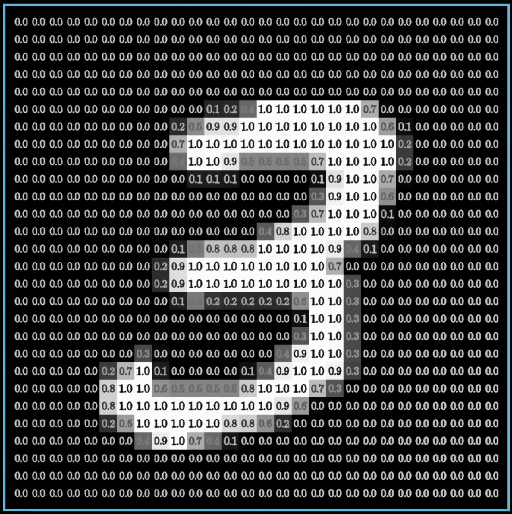

The main thing here is to find a way to structure a Neural Network to allow it to recognize digits based on 28x28 image inputs.

After looking at images from the training dataset several times, the Neural Network will eventually **find a way** to find the differences between the digits, and have specific neurons **activate** when these differences are found, and pass this information to the next layers in the NN.

> Activation functions are applied as layers, and they determine which parts of the image to keep, or ignore. For example, ReLU, a non-linear function, helps us keep the highest pixel value from a previous layer, ignoring all negative data. For CNNs, this has a huge impact on performance and accuracy, as non-linearity is one of the reasons why CNNs are able to achieve tremendous accuracies compared to linear models using linear transformations.

### Input layer

Since our MNIST dataset contains 784 pixels in total for all images, a Neural Network that wants to learn how to recognize which digit we give it, will require 784 neurons in the first layer, called the **input layer**. If we were to use less neurons on this layer, we'd be effectively throwing away input pixels from the images!

So, the first thing we do is **flatten** all the pixels (because typically they are represented in a matrix holding these pixel values), so we take each row of pixels, and put them one after the other, creating a vector of dimension (1, 784).

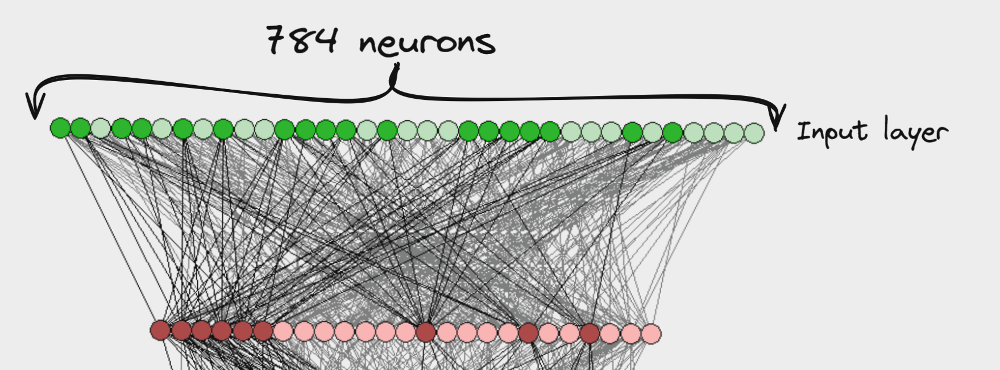

Now, in the case of working with color images in a dataset, the input layer needs to be different: the number of neurons in the layer isn't the number of pixels in an image. Because we humans typically use RGB images as input, the input layer has three channels, corresponding to the red, green, and blue colors, respectively.

We hold the pixel value information for each one of the pixels of the image, for each channel. Each one is assigned a different tensor (an n-dimensional matrix) which holds this information. So, in theory, when working with RGB images or video, we're effectively tripling (or quadrupling if using the RGBA standard) the amount of data that we hold.

### Output layer

Now, the last layer needs to have as many neurons as things we need to predict. Since this dataset is all about digit recognition, and we have 10 different digits in our numerical system, we need to have 10 layers in this output layer.

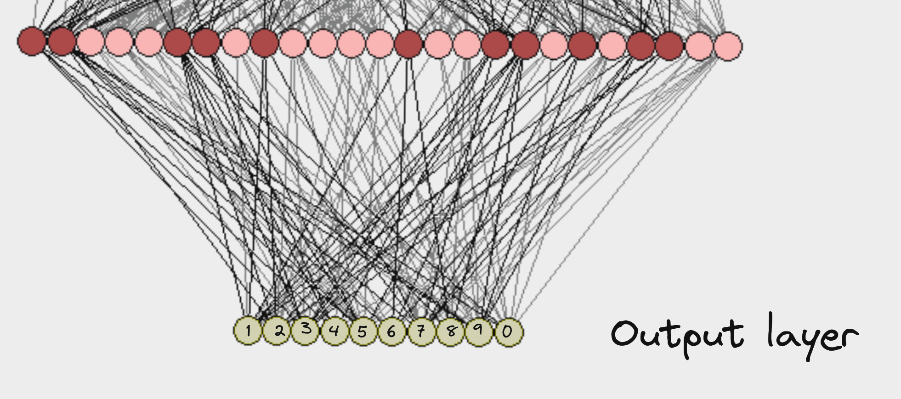

For example, if we had a NN that tried to classify domesticated animals, we would require to have as many neurons in the output layer as domesticated animal types there are. It depends entirely on the problem you're trying to solve.

### Hidden layers

The rest of the layers (the ones between the input and output layers) are called hidden layers. If a NN has more than 1 hidden layer, it can be categorized as a Deep NN (DNN). Usually, NNs for Computer Vision are almost (if not always) DNNs, as they contain lots of pre-configured, optimized hidden layer blocks, that aim to make detecting objects more efficient and accurate.

In the hidden layers, we can find **Convolutional Layers**, the foundation of CNNs. They contain learned kernels, or weights, that extract the required features to distinguish images from one another, or objects within these images.

A CNN will perform the dot product with the kernel and the output of the previous layer (in this following example, the input layer):


Note that, for each dot product operation, we take pixels from the top left of the image, towards the bottom right, in a group of 1 pixel + all other surrounding pixels (9 in total). Then, we multiply each one of the grayscale pixel values by the kernel, which also has 9 values in its vector.

> The kernel size (also called filter size or sliding window size) determines how many pixels we take around a pixel to multiply it with the kernel values. If the kernel size is 3, like in this case, we take blocks of 3x3 pixels.

Then, all these values are summed in the end to get the final value of the pixel in the convolution, and do that for every pixel in the image. You can see this intermediate step here:


Then, an elementwise sum is performed containing all 3 intermediate results along with the bias the network has learned (one for each color channel in RGB).

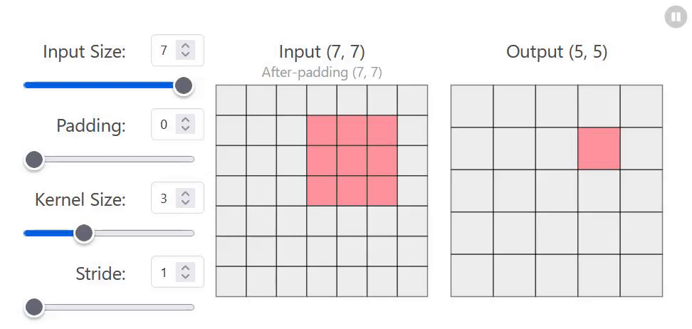

And that's all the basic functionality, except this process is repeated several times (depending on how many convolutions you choose to put in the hidden layers) in the hidden layers, and eventually arrive to the output layer, responsible of choosing a result / class.

### So, how does the NN learn the kernel and weights?

The kernel and layer weights are modified over and over through a process of trial and error. In a simplified manner, this is what happens:

- The untrained NN takes a look at a batch of images from the training dataset, e.g. 16 images
- It uses 12 for training and 4 for testing
- From the 12 images, it uses random weights, or weights taken from pretrained models with the same layer architecture (someone else's checkpoint to begin training)
- It tests those weights, and sees how they work against the 4 images
- If these 4 images are being detected into their correct class, then these weights must be good! Otherwise, penalize the weights and try again on the next iteration. The **learning rate** and other hyperparameters have a say on the penalty mechanism.
- Eventually, after thousands of iterations (not uncommon for Computer Vision), weights stabilize into some values
- At the end of the process (which is infinite), you might get worse results than with a previous checkpoint

> Note: AI developers try to avoid trial and error as much as possible, so they begin training from a foundational model's checkpoint, that already has learned how to detect common edges and  shapes from objects, so their kernel weights are already tuned to accomodate to our world.

Theoretically, if you were to repeat this process for hundreds of millions of iterations, you might hit a *plateau*: this theoretical limit is set by the quality of your training images - the more you have, the richer your data will be and the more the NN will be able to learn from it.

> After some time, it makes no sense to keep training the same CNN with the same data, as you will be able to improve accuracy very little, e.g. from 88.00% accuracy to 88.0000001% after a thousand extra iterations. It might also happen that the model starts to slowly lose accuracy after a while, which might indicate you're hitting that theoretical limit for the dataset you have and hyperparameters of your NN; in which case you will need to stick with a previous checkpoint.

### OCI Vision

In the case of OCI Vision, this is just one of the many pre-trained models out there. I can't comment on the datasets used for training the model, but I can assure you this has been trained with CNNs, and each release from OCI Vision corresponds to a newer, more accurate checkpoint.

Here's an example of what you get on OCI Vision, and how to interpret the result:

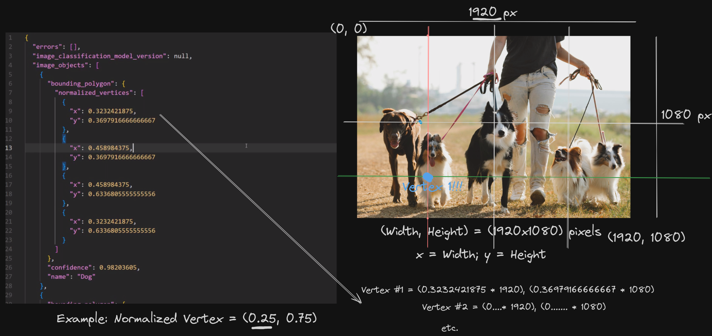

The CNN is trained not to detect which class of animal is in the image, but to also return the bounding box surrounding the object.

Even though most data representations are similar in general, there are always difference. This is the reason why checking the official documentation is important (and will save you time overall!). For example, in the following image:


You can see that the bounding box representation of the detected object in the image varies, depending on which framework / service we're using: OCI Vision uses a different number of keypoints (4) (as well as a different order of these keypoints) when compared to OpenCV (only gives you the top left and bottom right keypoint).

Here are some solutions from the ([AI solutions hub](https://www.oracle.com/artificial-intelligence/solutions/?source=:so:ch:or:awr::::AISolutionsHub)) that demonstrate how to apply these concepts we talked about in this chapter into a real-world solution:

- [Customized Object Detection with OCI Vision](https://www.oracle.com/artificial-intelligence/ai-vision-for-object-detection/?source=:so:ch:or:awr::::AISolutionsHub)
- [Automate Invoice Handling with OCI Document Understanding](https://www.oracle.com/artificial-intelligence/automate-invoice-processing/?source=:so:ch:or:awr::::AISolutionsHub)
- [Breast and Lung Cancer Research with AI in OCI Vision](https://www.oracle.com/artificial-intelligence/early-detection-cancer-with-oci-vision/?source=:so:ch:or:awr::::AISolutionsHub)
- [Automatically Identify Damaged Packages Using Oracle AI Services](https://www.oracle.com/artificial-intelligence/identify-damaged-packages-with-ai/?source=:so:ch:or:awr::::AISolutionsHub)

## 5. Experimental Tech: Quantization

Quantization is a technique used to reduce the memory usage of NNs. Remember that the information contained in Neural Networks, after a network has been trained for a number of iterations, is a matrix or vector of values representing either the attention weights (in LLMs) or the neurons' weights and biases (for RNNs).

So, all these numbers are typically represented in floating point representation with 32 bits. Since 8 bits = 1 byte, each of these values requires 4 bytes to store this information.

As additional information, just know that values in 32-bit FP representation use the `IEEE-754` standard. Each number has 3 components:

- 1 bit for representing the sign (positive or negative)
- Exponent: 8 bits with a biased exponent format, allowing us to represent a number in binary scientific notation - with this format: `1.xxxxx * 2^n`, where `n` is the exponent.
    
    If I had `0.555`, it would be `1.11 * 2^-1`. The exponent becomes -1.

    By adding the exponent to the biased exponent format of single-point precision (127), you get `127 + (-1) = 126`

    This gets translated to binary: `01111110`

- Mantissa: 23 bits, representing the **fractional** part of the number in binary scientific notation, in our case `11`: `00000000000000000001011`

When performing quantization, most of the part that's cut out is the mantissa, which can get as low as 3 bits in 8-bit floating-point representation.

1. Let's see an example, with the original FP32 value of `0.7853`.

    > In this example we will only consider 1 value to quantize - so you see the process, but typically quantization is applied mathematically throughout whole matrices and vectors - the purpose is to quantize in parallel all elements of a matrix -.

2. Let's say all values range between -1 and 1. Here's an example weights matrix:

    ```bash
        [0.7853, -0.789, 0.456],
        [0.141, -0.718, 1.0],
        [-0.414, 0.236, -1.0]
    ```

3. Now, quantization can be applied in many ways, depending on how much precision you're willing to sacrifice to get lighter and lighter quantization. Let's say we want to do quantization from 32 bits to 8 bits.

    8 bits can effectively represent 2^8 = 256 different values.

    The scale factor is calculated with the following formula:

    ```bash
    scale_factor = (max_value - min_value) / (2^bits - 1)
    
    scale_factor = (1 - (-1)) / (256 - 1) = 2 / 255 = 0.00784
    # the scale factor represent how much each element in the matrix will need to get reduced / augmented during quantization
    ```

4. To quantize each one of the elements in the matrix:

    ```bash
    quantized_value = round((original_value - min_value) / scale_factor)

    quantized_value = round((0.7853 - (-1)) / 0.00784) 

    quantized_value = round(227.97) = 228
    ```

5. To dequantize, we perform the operation in reverse:

    ```bash
    dequantized_value = (quantized_value * scale) + min_value
    
    dequantized_value = (228 * 0.00784) + (-1) ≈ 0.78752
    ```

6. As you can see, after performing quantization and dequantization, the original value has changed, from `0.7853` to `0.78752`. This is due to the value represented in 8-bit precision during the quantization step, and then re-expanding this 8-bit value to 32-bits again during step 5. As a consequence:

    - Our NN's weights can now be represented in 8-bits, reducing memory consumption by 75% when loading the model
    - After the model has been loaded, if you're using a quantized model, matrix multiplications, dot products, and other underlying NN operations, are also much faster, as multiplying 2 8-bit FP matrices is also much faster than multiplying 32-bit ones
    - This leads to less energy consumption when doing inference
    - It also allows us to fit and use huge models (70B+ parameters) on smaller devices - this is what's happening nowadays with models being created for smartphones and smart devices, although most of these models don't yet do the calculations themselves locally; this is how quantization can help
    - Drawback: you lose precision - in the case of LLMs and attention weights, this causes slight misinterpretations of the meaning of texts; in RNNs this may lead to errors in classifying images and objects.

Quantization specially shines when working with real-time systems like edge devices (security cameras, smartphones) - it allows these models to run efficiently on devices with very limited computational resources.

Do you have to perform quantization all the time?
    
    > No, you need to find a balance between model size, speed and accuracy - depending on the hardware and NN you want to use.


Here's a visual video I created with [Manim](https://www.manim.community/) to visually see what happens to a weights matrix when applying quantization:


### Contributors

Author: [Nacho Martinez](https://github.com/jasperan)

Huge credits to the creators of [CNN Explainer](https://poloclub.github.io/cnn-explainer/) for their amazing tool (from which I took screenshots) to explain and visualize CNNs, called TinyVGG.

Last release: August 2024

This project is open source. Please submit your contributions by forking this repository and submitting a pull request!  Oracle appreciates any contributions that are made by the open source community.

### License

Copyright (c) 2024 Oracle and/or its affiliates.

Licensed under the Universal Permissive License (UPL), Version 1.0.

See [LICENSE](LICENSE) for more details.

ORACLE AND ITS AFFILIATES DO NOT PROVIDE ANY WARRANTY WHATSOEVER, EXPRESS OR IMPLIED, FOR ANY SOFTWARE, MATERIAL OR CONTENT OF ANY KIND CONTAINED OR PRODUCED WITHIN THIS REPOSITORY, AND IN PARTICULAR SPECIFICALLY DISCLAIM ANY AND ALL IMPLIED WARRANTIES OF TITLE, NON-INFRINGEMENT, MERCHANTABILITY, AND FITNESS FOR A PARTICULAR PURPOSE.  FURTHERMORE, ORACLE AND ITS AFFILIATES DO NOT REPRESENT THAT ANY CUSTOMARY SECURITY REVIEW HAS BEEN PERFORMED WITH RESPECT TO ANY SOFTWARE, MATERIAL OR CONTENT CONTAINED OR PRODUCED WITHIN THIS REPOSITORY. IN ADDITION, AND WITHOUT LIMITING THE FOREGOING, THIRD PARTIES MAY HAVE POSTED SOFTWARE, MATERIAL OR CONTENT TO THIS REPOSITORY WITHOUT ANY REVIEW. USE AT YOUR OWN RISK.
