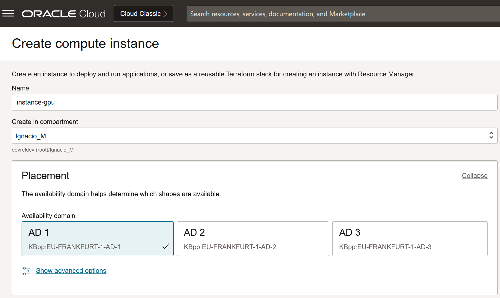
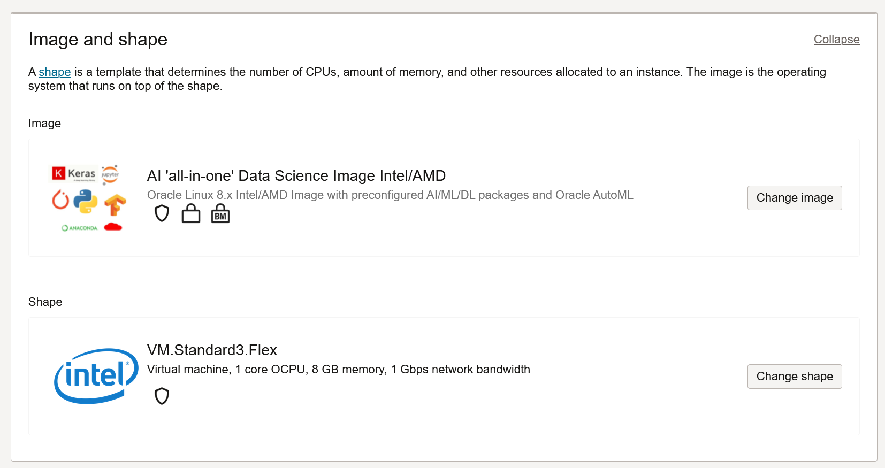
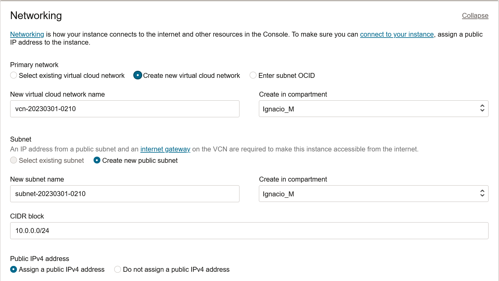
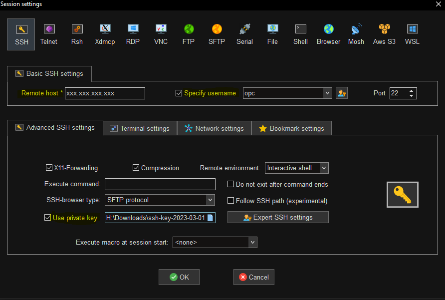

# Lab 2: Infrastructure

Estimated Time: 10 minutes

## Introduction

In this lab, we will quickly prepare the infrastructure for manually training our Computer Vision model **in the next workshop**. This directly relates to the next workshop, where I will teach you how to do the things we've done with RoboFlow in this workshop (training, data augmentation), but using 100% open-source code.

The OCI service that we'll use for this is **OCI Compute**. 

## Task 1: Create OCI Instance

First, we'll go into our [OCI Compute panel](https://cloud.oracle.com/compute/instances) and create a new instance. The name of the instance can be anything you want, and you should choose the Availability Domain (AD) depending on your region and the AD's allocated resources (varies over time). I usually go with AD 1, and if I run into any issues, I iterate.



We're going to use a **platform image** from Oracle called **OCI DSVM**. This image contains several tools for data exploration, analysis, modeling and development. It also includes a Jupyter Notebook, a conda environment ready to use and several more things (like Christmas for a Data practicioner).



We can find the platform image by selecting the *Marketplace* button:


Network settings for the Virtual Machine are very standard. Just make sure to create a new VCN and a new subnet, so that there's no possible way we get any networking issues from other OCI projects you may have.


Finally, we'll let OCI generate a SSH keypair, which we'll use to connect to the machine.


## Task 2: Access OCI Instance

To access our instance, let's copy the primary IP address that was allocated to our VM once the provisioning of this machine is done.


Once we have the IP address, and having previously saved our public-private keypair (which is what we will use to authenticate ourselves to the machine), let's connect through SSH. 


### Linux & macOS Users

Open a new terminal and run:

```
<copy>
ssh -i <private_key_absolute_path> opc@IP_ADDRESS
</copy>
```

For example, I have my SSH keypair saved in my downloads folder. Imagine my VM's IP address is 192.168.0.1. I will execute:

```
<copy>
ssh -i /home/user/Downloads/my_key.key opc@192.168.0.1
</copy>
```
> **Note**: `opc` is the default user for Oracle Linux Operating Systems, like the one running in our VM.

### Windows Users

For Windows users, I recommend using [MobaXterm](https://mobaxterm.mobatek.net/). 

First, set up a new session, making sure to specify the remote host (IP address), username (opc) and the private key's location:



Now, just click on "Quick Connect" and connect:


> **Note**: we will connect to our VM  and start training / augmenting our data with open-source repositories. 

## Task 3: Clone Open-Source Repositories

Once we have connected to our instance, let's download two repositories: YOLOv5 and YOLOv8. You're free to choose either one of them to train and augment our computer vision models, but this guide will show you how to proceed with YOLOv5.

Run the following commands:

```
<copy>
# download yolov5
git clone https://github.com/ultralytics/yolov5.git 
# download yolov8*
git clone https://github.com/ultralytics/ultralytics.git
</copy>
```
> **Note**: `git` is another tool that's already installed in the custom image we used to spin up our instance. *YOLOv8 can also be installed directly from pip. More information [in this link.](https://github.com/ultralytics/ultralytics#documentation)


Now that we have cloned our repositories, we're virtually ready to start training. You may now [proceed to the next lab](#next).

## Acknowledgements

* **Author** - Nacho Martinez, Data Science Advocate @ Oracle DevRel
* **Last Updated By/Date** - February 29th, 2023