# Lab 3: Explore RoboFlow

Estimated Time: 40 minutes

## Overview

We are going to use **RoboFlow** as our data platform for this workshop. The good thing about RoboFlow is that it eases the process of labeling and extracting data - in some ways, it works as a data store of hundreds, even thousands of projects like mine, with thousands of imagesa each; and all of these projects are **public** (meaning, we can use someone else's data to help us solve the problem).

Oh, and RoboFlow is free to use for public projects - I've never had issues with lacking storage space for a project. Shoutout to the RoboFlow team for their continued support.

## Task 1: Creating RoboFlow Workspace & Project

Before getting into any specifics, let's create a RoboFlow *workspace* and *project*, which will let us store all the images we will use to create our Computer Vision model.

First, we go into [RoboFlow's app](https://app.roboflow.com/) and select _Add Workspace_. 

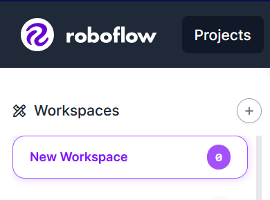

We set up the workspace with these settings:

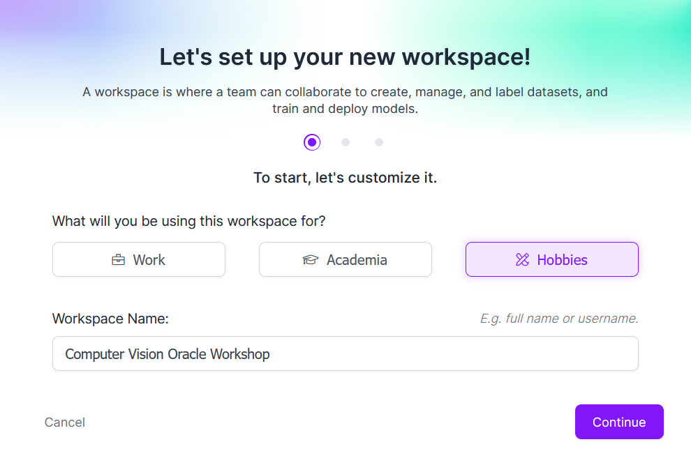

We specify our workspace to be _community_, meaning that all images we publish will be public. After the workshop, you can delete the project if you'd like.

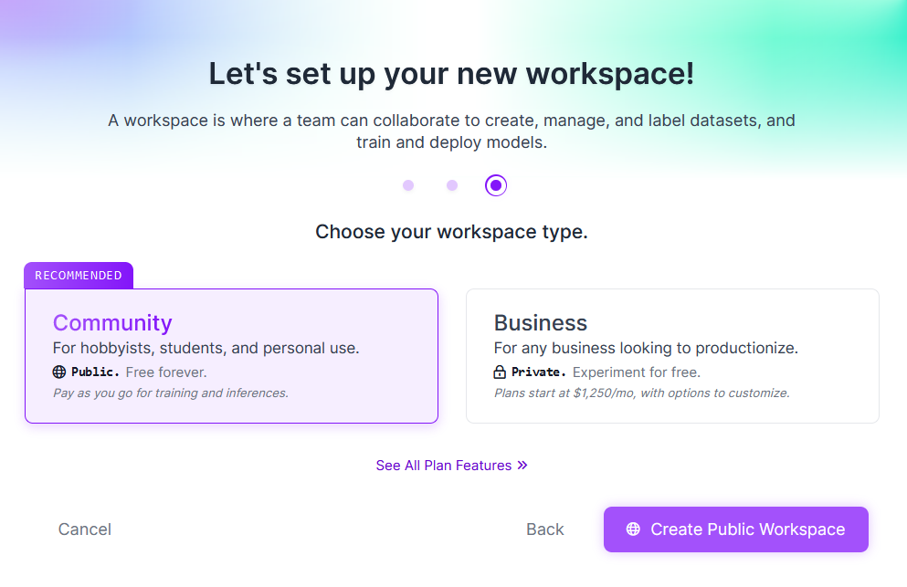

And now, within the workspace, we create a new project with these parameters:

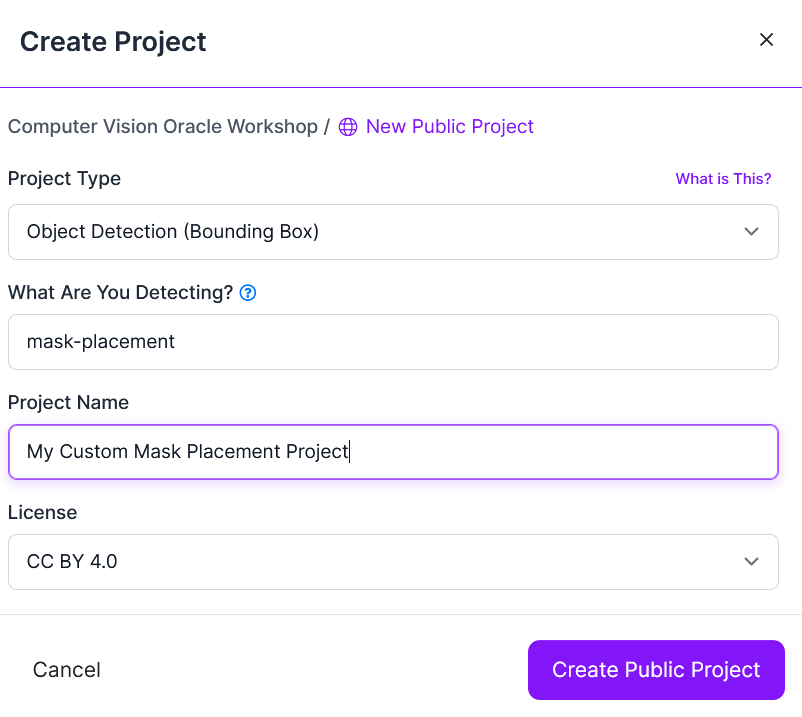

Now, we're ready to begin.

## Task 2: Creating Dataset

The first thing I looked for when starting to work on this project was *data*. We need hundreds, if not thousands, of images of people wearing masks in different ways and to label them. But creating this dataset from scratch - with no help - would take us tens of hours of grueling work (labeling data)

So, we need to look for some projects that already had a similar idea, and to try to "harmonize" all these project's images into a model that encapsulates all other, smaller models.

Let's go into [RoboFlow Universe](https://universe.roboflow.com/) (their collection for open-source vision ML datasets and APIs) to look for some already-labeled data.

These two projects look very interesting:

- [Incorrect Mask Outside Mosaic Clean Computer Vision Project](https://universe.roboflow.com/features-dataset/incorrect-mask-outside-mosiac-clean), with 346 images ready for training,
- [Face Mask Computer Vision Project](https://universe.roboflow.com/ditworkspace/face-mask-jk4nr), with 3660 images (2800 for training, 800 for validation, 75 for testing)

The first thing we will need to do is to download these datasets into our local computer. We need this because there are certain problems with the data which we can't fix from RoboFlow itself.

The first problem is that the classes for each one of these datasets have *different labels*, which we don't want: we want our model to only predict **three** classes/states. Let me demonstrate:

> **Note**: example of an image from the first dataset. The corresponding labels were: _`NoMask`_, _`Mask`_, _`IncorrectMask`_.

> **Note**: example of an image from the second dataset. The corresponding labels were: _`Masque`_, _`PasMasque`_, _`NotCorrect`_.

So, the first issue we have is that we have a *label mismatch*; we have two data sources but they have been created with different label names for each one of the detections. We need to **harmonize** this somehow. For this, let's clone both repositories to our local environment, and extract them.

> **Note**: click on "Download this Dataset".

After downloading both datasets into our local computer, we get something like this:

If we've done everything correctly, we should have downloaded all images from the datasets, which are split into *train*, *test*, and *validation* groups.

## Task 3: Manipulating Datasets

First, let's make a quick intro on why we have all images from each dataset in one of these three aforementioned directories, and what each of these directories represent:

- **Train**: The first type of dataset in machine learning is called the *training* dataset. This dataset is extremely important because it is used to train the model by adjusting the weights and biases of neural networks to produce accurate answers based on the inputs provided. If the training dataset is flawed or incomplete, it is very difficult to develop a good working model.

- **Validation**: After the training process, you need to ensure that the work being done is either good or bad. The validation dataset is what YOLOv5 will use (by default) to choose the *best hyperparameters* for our problem, and also tell us the average precision of our model during training. 
    > **Note**: validation will affect how the model performs, but not as much as the quality of the data found in the training dataset. 

- **Test**: The final dataset is the test dataset, which gives us an evaluation of how well the model is performing *after training*. This also lets us know if our model has issues like overfitting or underfitting.  It is important to have a large enough validation and test dataset to get successful results, especially when there are many hyperparameters involved.

Let's open one of the datasets. You should see this:

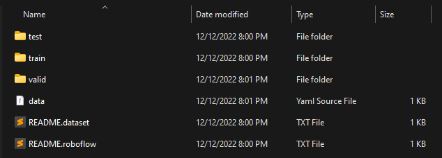

The file that holds all links and values is called `data.yaml`, with a structure like this:

> **Note**: _`nc`_ represents the number of classes, with each class name in the _`names`_ list. It also contains a path to each dataset directory (it's recommended to modify these to be absolute paths, not relative ones). Also, if label names are weird or hard to understand like numbers, you can check what each labels mean by visually inspecting the dataset. For example, I looked at some pictures and made sure that the _`PasMasque`_ class actually represented a *lack* of mask, and that other classes were also correctly represented by correct, meaningful labels.

We need to modify this YAML file to include the names of the classes that we want, making sure that the order of the labels is also preserved.

> **Note**: if the number of classes varies (is different than what we want), we also have to modify the variable `nc` accordingly, which represents the total number of classes that the dataset is trained to recognize.

We have to repeat this process with the second dataset. 

Finally, once we have our class/label names harmonized in all our datasets, let's go into RoboFlow and import both datasets into our RoboFlow project.

Now that we have the same labels for all datasets, the dataset will be imported successfully and we will have a merged dataset in our hands. 

> **Note**: after importing, you should see that all images have been imported with their correct label names.

## Task 4: Adding More (our own) Data

In this section, we'll quickly go over how to add custom data. For this, I'm going to use my webcam to add some additional images to my dataset, which will also be included in the final model. 
> **Note**: We will also have the opportunity to tell YOLOv5 where we want to include our data (in which dataset: training, testing, validation, or any combination of these three!)

First, I go into my RoboFlow account:

Then, I click on my Mask Detection Placement model:

Finally, let's upload some new images to include in the model. I will upload my images by importing a YouTube video of myself; but you can use any pictures you have on your phone or computer, just make sure that you get a healthy ratio of images with different mask-wearing states (correctly, incorrectly, no mask at all).

We need to be mindful of which **sampling rate** to choose: if we select a sampling rate that's too high, it will cause the dataset to have very similar images, as they will be taken almost one after the other. If the sampling rate is too low, we won't get enough images from the video.

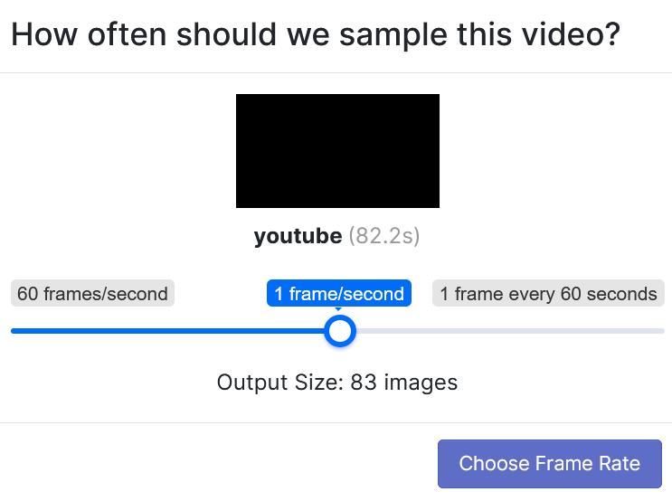
> **Note**: I chose a sampling rate of 1 frame every 5.7 seconds, as this is just a test.

Then, we get the selected frames from the video:

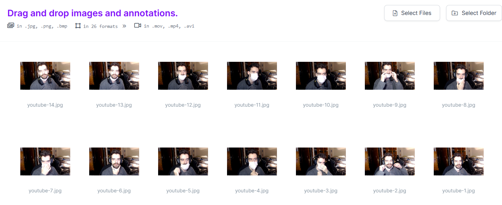

The last thing to do now is to **annotate** these images. We will annotate using bounding boxes (see below explanation why this is a good annotation method for our problem).

We go to the Annotate section in the toolbar:

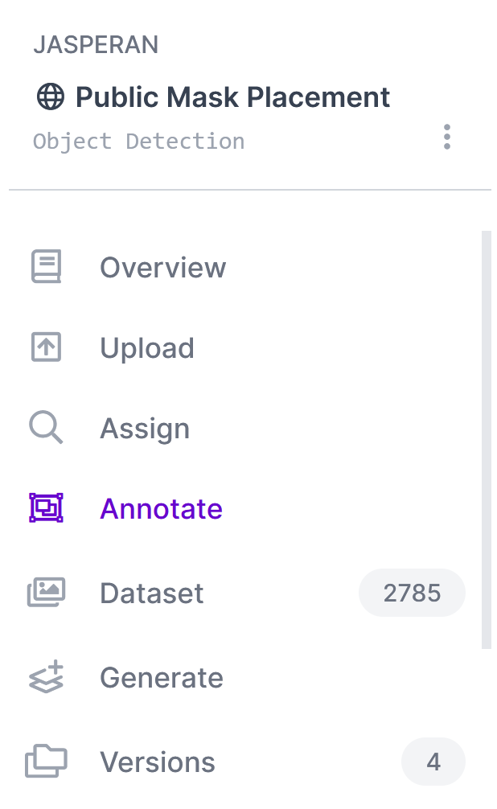

Then, we click on our new images, ready to be annotated:

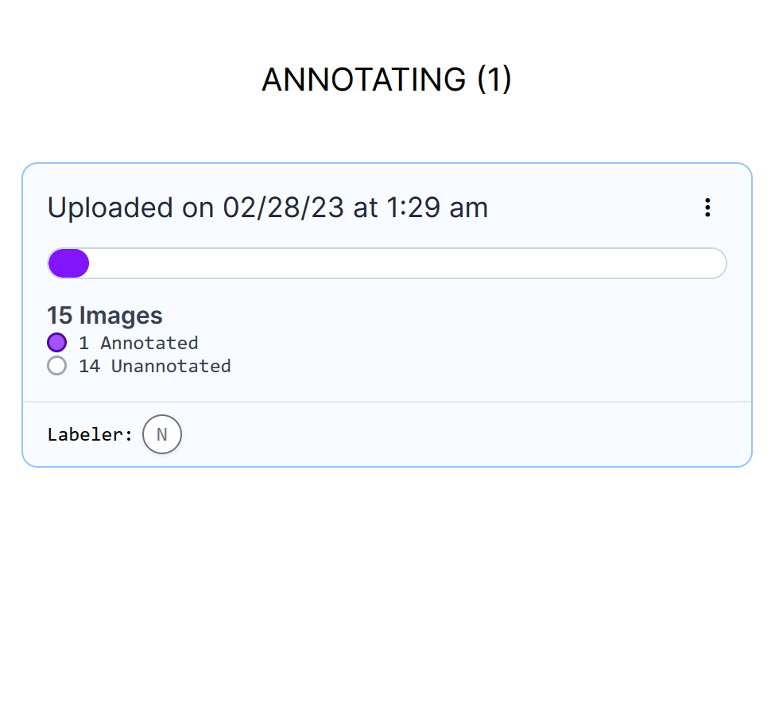

Then, we click on any image and start annotating:

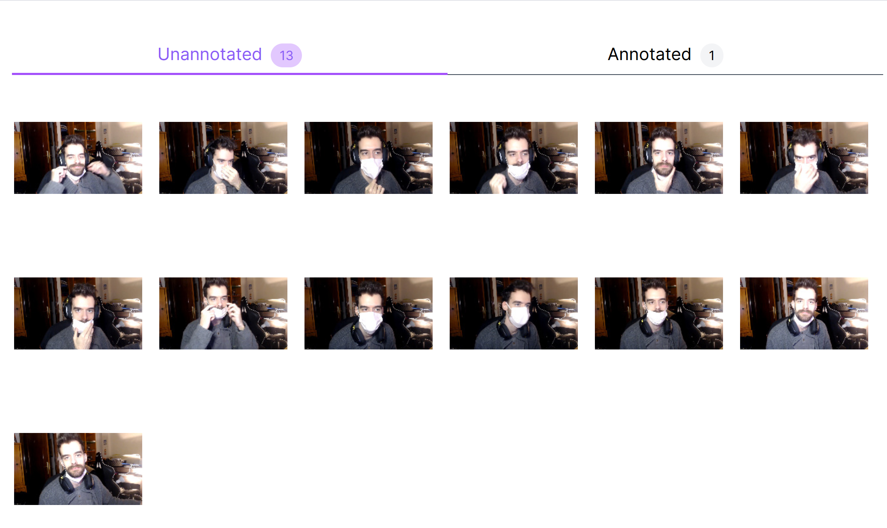

We click on the following button in the toolbar:

Now, we click and drag across the image to create a new annotation, then use the Class Selector to choose its label:

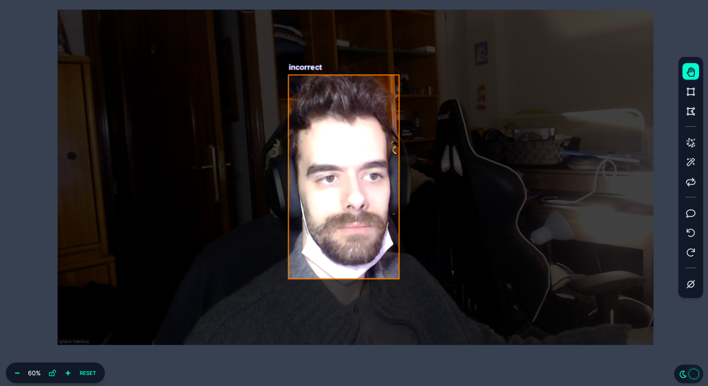

We repeat this process for every image. Then, we'll choose into which dataset these images will go:

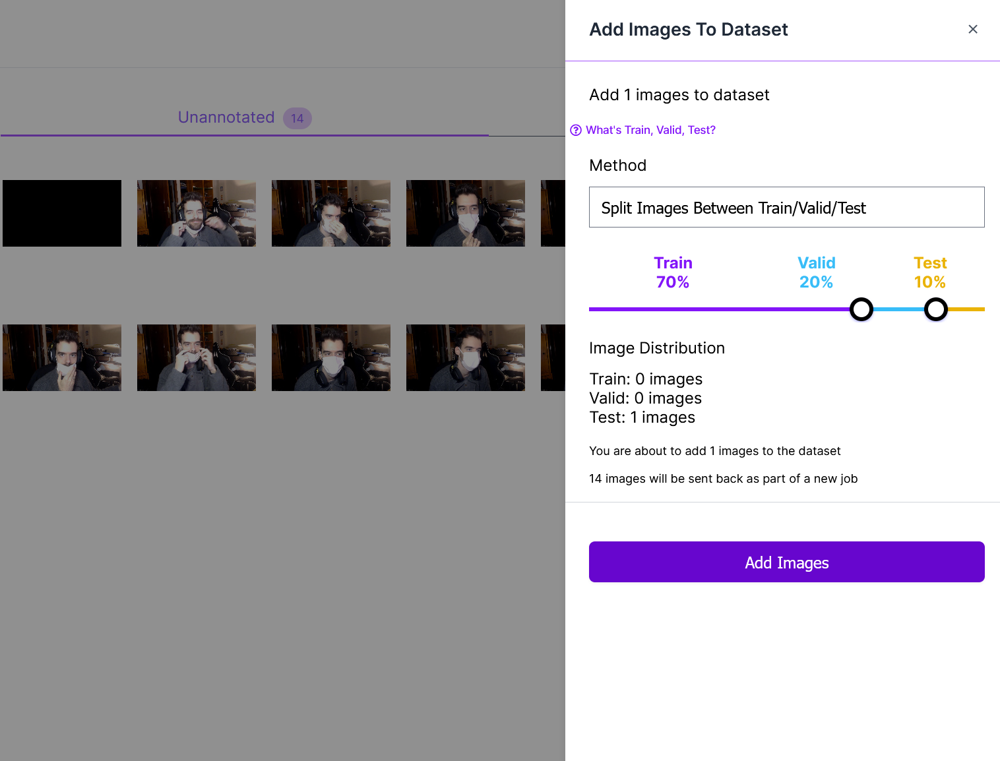
> **Note**: I recommend 80%-10%-10% for training-validation-testing for most cases.

We can now proceed to augmenting our dataset and generating a new version.

### Different Annotation Strategies

Depending on the type of problem, you will need to have a different annotation technique. The three most common ones are:
- Bounding Boxes: they are rectangles that surround an object and specify its position. This method is perfect for our mask placement model.
- Polygons: this method takes more time than bounding boxes, but increases performance (accuracy), as the model will be trained on data that's been more constrained. You can annotate an image using the traditional method of drawing a bounding box, without using a polygon. This method takes less time for annotators, but results in missing some added performance. Thus, if you have the resources and you have decided polygon annotation is helpful, it is worth going the extra mile.
- [Smart Polygons](https://blog.roboflow.com/automated-polygon-labeling-computer-vision/): RoboFlow simplifies this process by having their own Smart Annotation, which will detect an object and try to draw its edges interactively.

Here are three examples, one for each type of annotation:

> **Note**: bounding box annotation.
> 

> **Note**: polygon annotation.
> 

> **Note**: smart polygon annotation.

## Task 5: Augmenting Dataset with RoboFlow and Generating a new Version

First of all, we go to our toolbar:

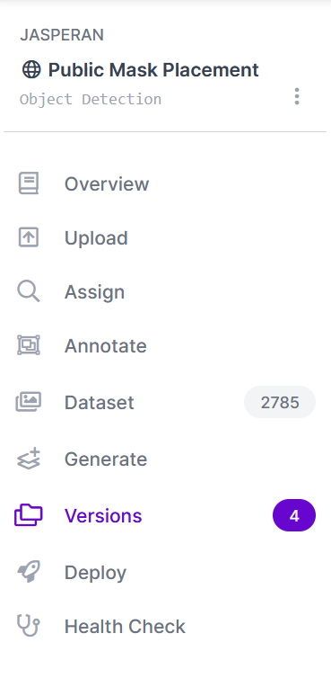

Now that we've finished annotating our data, let's talk about **dataset augmentation**. For this, let's go to [our RoboFlow project](https://app.roboflow.com) and generate a new dataset version under the **Generate** tab:

Augmentations create new training examples for your model to learn from. In the fourth step - to generate a new dataset - I chose the following augmentations:

- **Grayscale** (applied to 10% of my training data): with this, I'm aiming to also replicate possible future inputs from CCTV cameras or video feeds with old camera/hardware equipment. Hopefully, after training 10% of my data in grayscale instead of color, I'll also allow B&W cameras to test out my model.
- **Blurring** (up to 1.25px): to train the model to work well against out-of-focus people wearing masks. 1.25px is not an extreme transformation but it smooths out edges.
- Bounding Box **Noise**: this adds noise _inside_ the bounding boxes in my training dataset and generates variations to help my model be more resilient to camera artifacts. I also wanted to "simulate" a low bit rate when analyzing videos directly from a Twitch stream or similar live-stream feeds.

Here are the differences between using no augmentations and using them:

Another augmentation that I find very helpful - especially if you're struggling to detect *small objects* - is the **mosaic** augmentation, which will put several images together simulating a mosaic so that the model learns to detect the objects we want when these objects occupy a smaller portion of the screen.

Finally, after applying all these dataset augmentations, it's time to give RoboFlow the ability to generate these augmented images. Thanks to their *amazing* support (thank you, RoboFlow team!), they gave me some training credits for free and allowed me to generate my augmentations up to *5x* (5 augmentations per image in the training dataset):

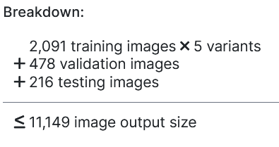

After some time generating this new version, we can train the model automatically with RoboFlow and check the [mean average precision (mAP)](https://learnopencv.com/mean-average-precision-map-object-detection-model-evaluation-metric/) for each class, including some other interesting stats that will be helpful to iterate over our model afterward:

## Task 6: Training with RoboFlow

Since I had some free training credits, I decided to spend one of them to see how my model would perform initially:

I recommend to start training from a public checkpoint, like the one from the COCO dataset, with a 46.7% mAP. This dataset has previously been trained to detect objects from the real-world, and even though it doesn't recognize mask placement, it will serve as a starting point for the Neural Network, which, despite its lack of knowledge of what a 'COVID-19 Mask' is, it's learned to detect other things, like **edges** of objects, shapes and forms. This means that the model _knows_ about the real-world, even if its knowledge is limited. So, let us try with this model first. 

## Task 7: Conclusions

After the training process is complete (can take up to 24 hours), we can see the following:

In more detail, we get average precision broken down by validation and testing sets:

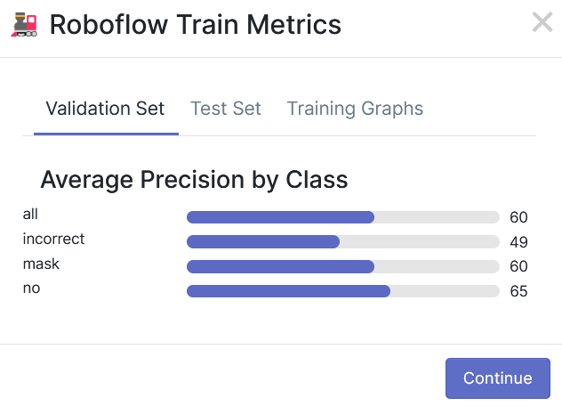

> **Note**: since the validation set had fewer pictures than the test set, and the validation set has a lower precision, this leads me to believe that the lower precision on the validation set is caused by having too few pictures, and not by the model being inaccurate on detections. We will fix this in the next article, where we will make a more balanced split for our dataset.

Also note that -- across validation and test set -- the "incorrect" label has a constant precision of **49%**. This makes sense, as it's the hardest class to predict of the three - it's very easy to see the difference between someone with our without a mask, but incorrectly-placed masks are harder to detect even for us. Thus, some pictures we may fail to be recognized as humans. As great, new professionals in Computer Vision, we will take note of this and we'll find a way to improve the precision in the future - taking special care with our under-performing class.

## Acknowledgements

* **Author** - Nacho Martinez, Data Science Advocate @ Oracle DevRel
* **Last Updated By/Date** - February 28th, 2023