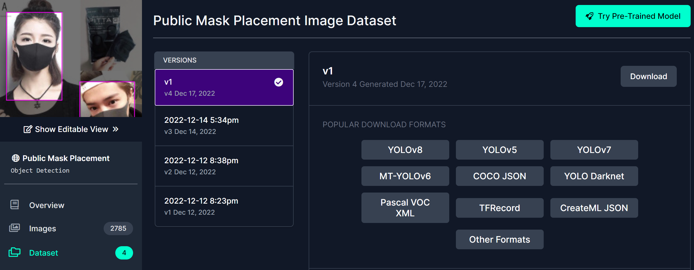
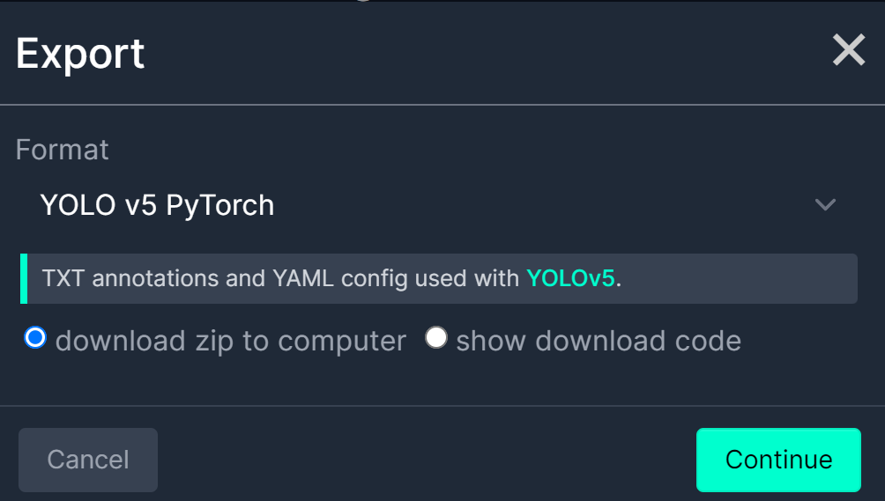
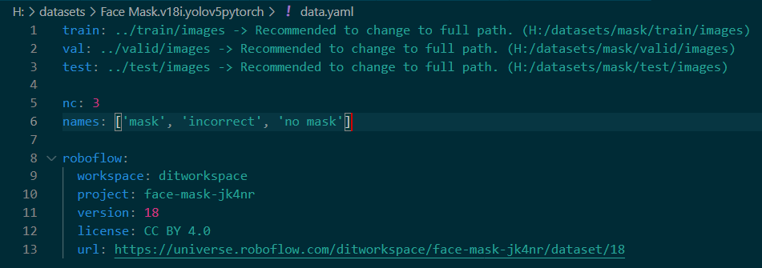

# Introduction

## Introduction

Estimated Time: 5 minutes

If you remember what we spoke about [in our last workshop](../../workshops/mask_detection_labeling/index.html), we created a Computer Vision model able to recognize whether someone was wearing their COVID-19 mask correctly, incorrectly, or simply didn't wear any mask.

We used [RoboFlow](https://roboflow.com) as the platform to help us during the creation of the model. It was especially useful to accelerate our data labeling process, as well as gathering data from other Computer Vision folks using [RoboFlow Universe](https://universe.roboflow.com/).

Now, as a natural continuation of this topic, I will show you how you can **train and improve the model** using Oracle Cloud Infrastructure (OCI). This applies to any object detection model created using the YOLO (You Only Look Once) standard and format - we will still use this framework to operate.

At the end of this workshop, you'll be able to perform **real-time inference** like I did here, with a video of me:

Additionally, you will learn how to create your own model versions, which parameters are good or bad, and how to automatically **augment** your dataset before/during training.

### Prerequisites

It's highly recommended to have completed [the first workshop](../../workshops/mask_detection_labeling/index.html) before starting to do this one, as we'll use some files and datasets that come from our work in the first workshop.

### Hardware

To train our YOLO models, we will learn some infrastructure. We will use Oracle Cloud Infrastructure (OCI) to satisfy our needs. We'll talk more about how to create this hardware (in case you haven't completed the [first workshop](../../workshops/mask_detection_labeling/index.html)) in the next lab.

## Task 0: Download Dataset

If you have completed the first workshop, please skip this section.

However, if you haven't completed the [first workshop](../../workshops/mask_detection_labeling/index.html), and have your own custom final dataset ready, you can use my dataset to get started. For this, go into [the project's RoboFlow Universe URL](https://universe.roboflow.com/jasperan/public-mask-placement/dataset/4):

Once we're on this website, we choose to download the dataset **in YOLOv5 format**:

We unzip it, and make sure that our _`data.yaml`_ file looks like this:

This file holds all links between our YOLOv5 dataset, so once we have our paths ready and verified that the class names and the number of classes are correct, we can proceed to augment and train this dataset.

## Task 1: Objectives

In this lab, you will complete the following steps:

&check; Using an OCI Compute Instance to **train** our Computer Vision models

&check; Learn about **Automatic Data Augmentation** to improve our datasets (with YOLO)

&check; **Use** these models with Python!

## Task 2: OCI Elements

This solution is designed to work mainly with OCI Compute. We will use an OCI Compute Instance to save costs (compared to other Cloud providers) and train our Computer Vision model.

You can read more about the services used in the lab here:
- [OCI Compute](https://www.oracle.com/cloud/compute/)

## Task 3: Useful Resources

Here are three articles to get you from beginner to Computer Vision *hero*. This workshop is partly based on the content present in these Medium articles.

- [Creating a CMask Detection Model on OCI with YOLOv5: Data Labeling with RoboFlow](https://medium.com/oracledevs/creating-a-cmask-detection-model-on-oci-with-yolov5-data-labeling-with-roboflow-5cff89cf9b0b)

- [Creating a Mask Model on OCI with YOLOv5: Training and Real-Time Inference](https://medium.com/oracledevs/creating-a-mask-model-on-oci-with-yolov5-training-and-real-time-inference-3534c7f9eb21)

- [YOLOv5 and OCI: Implementing Custom PyTorch Code From Scratch](https://medium.com/oracledevs/yolov5-and-oci-implementing-custom-pytorch-code-from-scratch-7c6b82b0b6b1)

You may now [proceed to the next lab](#next).

## Acknowledgements

* **Author** - Nacho Martinez, Data Science Advocate @ Oracle DevRel
* **Last Updated By/Date** - March 10th, 2023